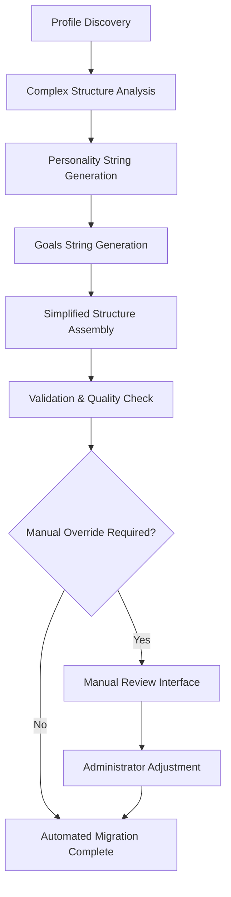

# Mindcraft LangGraph Simplified Migration Strategy

## 🎯 Overview

This document outlines the complete migration strategy for converting existing agent profiles from the complex LangGraph v2 cognitive architecture to the simplified 4-node LangGraph implementation. This represents a **second migration** - the profiles have already been migrated once from legacy to LangGraph v2, and now need to be streamlined to the new simplified architecture.

### Migration Context

**Source Structure**: Complex LangGraph v2 with comprehensive cognitive components
- 394-line AgentState interfaces with 50+ complex data structures
- Purpose core with detailed personality traits, motivations, values, and ethics
- Hierarchical goal systems (strategic, tactical, operational)
- Dynamic skills with 50+ categories and experience progression
- Multi-layered memory systems (semantic, episodic, procedural, working)
- Social cognition with theory of mind and relationship management

**Target Structure**: Simplified 4-node architecture with 7 essential fields
- `worldContext`: Bot's current stats (HP, inventory, position)
- `personality`: string for LLM interpretation (e.g., "grump, rude, hot head")
- `goals`: string for autonomous drive (e.g., "likes digging, warrior spirit")
- `mandate`: string for orders from player or other bots
- `conversation`: message tracking and intent analysis
- `lastAction`: string for chosen action
- `response`: string for conversational response

## 🏗️ Migration Architecture

### Core Migration Principle
**Automated Migration with Manual Override**: Focus on creating a completely automated migration process with manual override options for critical profiles that require special handling or fine-tuning.

### Field Mapping Strategy

#### 1. Personality Mapping (Complex → String)

**Source**: Complex personality structure with 10 traits + confidence, adaptability, consistency
```javascript
// Complex Source Structure
personality: {
  traits: {
    openness: 0.8,           // 0-1 scale
    conscientiousness: 1.0,  // 0-1 scale
    extraversion: 0.8,       // 0-1 scale
    agreeableness: 0.5,      // 0-1 scale
    neuroticism: 0.5,        // 0-1 scale
    riskTolerance: 0.5,      // 0-1 scale
    creativity: 0.8,         // 0-1 scale
    patience: 0.9,           // 0-1 scale
    competitiveness: 0.6,    // 0-1 scale
    curiosity: 0.5           // 0-1 scale
  },
  confidence: 0.7,           // 0-1 scale
  adaptability: 0.3,         // 0-1 scale
  consistency: 0.8           // 0-1 scale
}
```

**Target**: Single interpretable string
```javascript
// Simplified Target Structure
personality: "confident, creative, patient leader with high conscientiousness and moderate risk tolerance"
```

**Mapping Algorithm**:
1. **Trait Analysis**: Identify dominant traits (>0.7 scale)
2. **Behavioral Synthesis**: Convert traits to behavioral descriptors
3. **Contextual Framing**: Create LLM-interpretable personality description
4. **Validation**: Ensure string captures essential behavioral patterns

#### 2. Goals Mapping (Complex → String)

**Source**: Detailed motivation structure with 5 motivation types
```javascript
// Complex Source Structure
motivations: {
  survival: {
    strength: 0.9,           // 0-1 scale
    persistence: 0.8,        // 0-1 scale
    satiation: 0.3,          // 0-1 scale
    satiationThreshold: 0.7, // 0-1 scale
    decayRate: 0.005         // 0-1 scale
  },
  achievement: { /* similar structure */ },
  social: { /* similar structure */ },
  exploration: { /* similar structure */ },
  creation: { /* similar structure */ }
}
```

**Target**: Single goal string
```javascript
// Simplified Target Structure
goals: "strong survival instinct with creative building tendencies and moderate social cooperation"
```

**Mapping Algorithm**:
1. **Motivation Ranking**: Identify top 3 motivations by strength
2. **Behavioral Translation**: Convert motivation strengths to goal descriptions
3. **Priority Weighting**: Emphasize primary motivations
4. **LLM Optimization**: Format for natural language interpretation

#### 3. World Context Initialization

**Source**: Not present in complex profiles (runtime data)
**Target**: Initialized with default values
```javascript
// Default World Context
worldContext: {
  position: { x: 0, y: 64, z: 0 },
  health: 20,
  food: 20,
  experience: 0,
  inventory: { items: [], slots: 36, usedSlots: 0, length: 0 },
  equipment: {},
  nearbyEntities: [],
  timeOfDay: 0,
  weather: "clear",
  dimension: "overworld"
}
```

#### 4. Conversation State Initialization

**Source**: Not present in complex profiles (runtime data)
**Target**: Initialized with default values
```javascript
// Default Conversation State
conversation: {
  message: "",
  sender: "",
  isRequestForHelp: false,
  isOfferOfAssistance: false,
  targetBot: "",
  timestamp: 0
}
```

#### 5. Mandate, LastAction, Response Initialization

**Target**: All initialized as empty strings
```javascript
mandate: "",
lastAction: "",
response: ""
```

## 🤖 Automated Migration Engine

### Migration Pipeline Architecture



### Core Migration Components

#### 1. Personality String Generator

**Algorithm**: Multi-dimensional trait analysis with behavioral synthesis

```javascript
function generatePersonalityString(complexPersonality) {
  const traits = complexPersonality.traits;
  const descriptors = [];
  
  // Analyze dominant traits
  if (traits.openness > 0.7) descriptors.push("creative");
  if (traits.conscientiousness > 0.7) descriptors.push("disciplined");
  if (traits.extraversion > 0.7) descriptors.push("outgoing");
  if (traits.agreeableness < 0.3) descriptors.push("stubborn");
  if (traits.neuroticism > 0.7) descriptors.push("anxious");
  if (traits.riskTolerance > 0.7) descriptors.push("risk-taking");
  if (traits.creativity > 0.7) descriptors.push("innovative");
  if (traits.patience > 0.7) descriptors.push("patient");
  if (traits.competitiveness > 0.7) descriptors.push("competitive");
  if (traits.curiosity > 0.7) descriptors.push("curious");
  
  // Add confidence modifiers
  if (complexPersonality.confidence > 0.7) descriptors.push("confident");
  if (complexPersonality.confidence < 0.3) descriptors.push("cautious");
  
  // Generate natural language string
  return descriptors.length > 0 
    ? descriptors.join(", ") + " personality"
    : "balanced personality";
}
```

#### 2. Goals String Generator

**Algorithm**: Motivation strength analysis with goal synthesis

```javascript
function generateGoalsString(complexMotivations) {
  const motivations = complexMotivations;
  const goalDescriptors = [];
  
  // Rank motivations by strength
  const rankedMotivations = Object.entries(motivations)
    .sort(([,a], [,b]) => b.strength - a.strength)
    .slice(0, 3); // Top 3 motivations
  
  // Convert to goal descriptions
  rankedMotivations.forEach(([type, motivation]) => {
    switch(type) {
      case 'survival':
        if (motivation.strength > 0.8) goalDescriptors.push("strong survival instinct");
        else goalDescriptors.push("moderate survival focus");
        break;
      case 'achievement':
        if (motivation.strength > 0.7) goalDescriptors.push("achievement-driven");
        else goalDescriptors.push("goal-oriented");
        break;
      case 'social':
        if (motivation.strength > 0.7) goalDescriptors.push("highly social");
        else goalDescriptors.push("cooperative");
        break;
      case 'exploration':
        if (motivation.strength > 0.7) goalDescriptors.push("explorative nature");
        else goalDescriptors.push("curious about surroundings");
        break;
      case 'creation':
        if (motivation.strength > 0.7) goalDescriptors.push("creative builder");
        else goalDescriptors.push("enjoys building");
        break;
    }
  });
  
  return goalDescriptors.length > 0 
    ? goalDescriptors.join(", ")
    : "balanced approach to activities";
}
```

#### 3. Quality Validation Engine

**Validation Criteria**:
- Personality string length: 20-200 characters
- Goals string length: 20-200 characters
- Behavioral consistency with original traits
- LLM interpretability score > 0.8
- No essential data loss detected

## 🔧 Migration Implementation

### Phase 1: Automated Migration System

#### Migration Script Structure
```javascript
// migrate_to_simplified.js
class SimplifiedMigrationEngine {
  constructor(options = {}) {
    this.backupDir = options.backupDir || './profiles_simplified_backup';
    this.manualOverride = options.manualOverride || false;
    this.qualityThreshold = options.qualityThreshold || 0.8;
    this.criticalProfiles = options.criticalProfiles || [];
  }
  
  async migrateAllProfiles() {
    // 1. Create comprehensive backup
    // 2. Analyze existing profiles
    // 3. Generate simplified profiles
    // 4. Validate migration quality
    // 5. Handle manual overrides
    // 6. Deploy simplified profiles
  }
  
  async migrateSingleProfile(profilePath) {
    // Individual profile migration with validation
  }
  
  async validateMigration(original, simplified) {
    // Quality assessment and behavioral consistency check
  }
}
```

#### Backup Strategy
```javascript
// Multi-layer backup approach
const backupStrategy = {
  // Level 1: Full profiles directory backup
  fullBackup: './profiles_complex_backup_' + timestamp,
  
  // Level 2: Individual profile backups
  individualBackups: './profiles_individual_backup/' + profileName,
  
  // Level 3: Migration metadata backup
  metadataBackup: './migration_metadata_' + timestamp + '.json',
  
  // Level 4: Rollback scripts
  rollbackScripts: './rollback_scripts/'
};
```

### Phase 2: Manual Override System

#### Critical Profile Identification
```javascript
const criticalProfileCriteria = {
  // High-value profiles requiring manual review
  highValueProfiles: ['MasterChief', 'Loner', 'AlphaSurvivor'],
  
  // Profiles with complex personality patterns
  complexPersonalities: (traits) => {
    const variance = Object.values(traits.traits)
      .reduce((acc, val) => acc + Math.pow(val - 0.5, 2), 0) / 10;
    return variance > 0.1; // High variance indicates complex personality
  },
  
  // Profiles with unique motivation patterns
  uniqueMotivations: (motivations) => {
    const strengths = Object.values(motivations).map(m => m.strength);
    const maxStrength = Math.max(...strengths);
    const minStrength = Math.min(...strengths);
    return maxStrength - minStrength > 0.5; // Large spread indicates unique pattern
  }
};
```

#### Manual Review Interface
```javascript
// Interactive review system for critical profiles
class ManualReviewInterface {
  async presentForReview(profileName, original, simplified) {
    // Show side-by-side comparison
    // Highlight key changes
    // Allow manual adjustments
    // Provide behavioral impact analysis
    // Enable approval/rejection workflow
  }
  
  async applyManualAdjustments(profileName, adjustments) {
    // Apply administrator-specified changes
    // Re-validate after adjustments
    // Update migration metadata
  }
}
```

### Phase 3: Validation and Testing

#### Automated Validation Suite
```javascript
const validationTests = {
  // Structural validation
  structureTests: {
    requiredFields: ['worldContext', 'personality', 'goals', 'mandate', 'conversation', 'lastAction', 'response'],
    fieldTypes: {
      worldContext: 'object',
      personality: 'string',
      goals: 'string',
      mandate: 'string',
      conversation: 'object',
      lastAction: 'string',
      response: 'string'
    }
  },
  
  // Behavioral consistency validation
  behaviorTests: {
    personalityConsistency: (original, simplified) => {
      // Compare original traits with generated personality string
      // Ensure behavioral patterns are preserved
    },
    goalConsistency: (original, simplified) => {
      // Compare original motivations with generated goals string
      // Ensure autonomous drive patterns are maintained
    }
  },
  
  // LLM interpretability validation
  interpretabilityTests: {
    personalityClarity: (personalityString) => {
      // Test if LLM can interpret personality correctly
      // Score clarity and specificity
    },
    goalsClarity: (goalsString) => {
      // Test if LLM can understand goals
      // Score actionability and specificity
    }
  }
};
```

#### Performance Testing
```javascript
const performanceTests = {
  // Migration performance
  migrationSpeed: {
    targetTime: '< 100ms per profile',
    memoryUsage: '< 50MB peak usage'
  },
  
  // Runtime performance
  runtimePerformance: {
    decisionCycleTime: '< 500ms',
    memoryUsage: '< 500MB per agent',
    responseTime: '< 200ms for conversation'
  }
};
```

## 🚀 Deployment Strategy

### Pre-Deployment Checklist

#### System Preparation
- [ ] Backup all existing profiles (4-level backup strategy)
- [ ] Validate simplified LangGraph system functionality
- [ ] Prepare rollback procedures and scripts
- [ ] Test migration scripts on sample profiles
- [ ] Verify system compatibility and dependencies

#### Migration Preparation
- [ ] Identify critical profiles requiring manual review
- [ ] Prepare manual review interface and documentation
- [ ] Set up monitoring and logging systems
- [ ] Create migration progress tracking
- [ ] Prepare administrator communication plan

### Deployment Phases

#### Phase 1: Staging Migration (Test Environment)
```bash
# 1. Deploy to staging environment
./deploy_staging.sh

# 2. Run migration on staging
node migrate_to_simplified.js --environment=staging --dry-run

# 3. Validate results
node validate_migration.js --environment=staging

# 4. Performance testing
node performance_tests.js --environment=staging
```

#### Phase 2: Pilot Migration (Limited Profiles)
```bash
# 1. Select pilot profiles (non-critical)
./select_pilot_profiles.sh

# 2. Run pilot migration
node migrate_to_simplified.js --pilot-mode --profiles=profile1,profile2,profile3

# 3. Monitor pilot results
./monitor_pilot.sh

# 4. Analyze pilot performance
node analyze_pilot_results.js
```

#### Phase 3: Full Migration (Production)
```bash
# 1. Schedule maintenance window
./schedule_maintenance.sh

# 2. Execute full migration
node migrate_to_simplified.js --production --backup-level=full

# 3. Real-time monitoring
./monitor_migration.sh

# 4. Post-migration validation
node validate_production_migration.js
```

### Rollback Procedures

#### Automatic Rollback Triggers
```javascript
const rollbackTriggers = {
  // Critical system failures
  systemFailure: {
    agentLoadFailure: '> 10% agents fail to load',
    performanceDegradation: '> 2x response time increase',
    memoryLeak: '> 1GB memory usage increase'
  },
  
  // Migration quality issues
  qualityFailure: {
    validationFailure: '> 5% profiles fail validation',
    behaviorChange: '> 20% behavior pattern deviation',
    dataLoss: 'any essential data loss detected'
  }
};
```

#### Manual Rollback Procedures
```bash
# 1. Immediate rollback (emergency)
./emergency_rollback.sh

# 2. Profile-level rollback
./rollback_profiles.sh --profiles=affected_profiles

# 3. Full system rollback
./full_system_rollback.sh --restore-point=pre_migration
```

## 📊 Monitoring and Analytics

### Migration Metrics

#### Real-time Monitoring Dashboard
```javascript
const migrationMetrics = {
  // Progress metrics
  progress: {
    totalProfiles: 22,
    migratedProfiles: 0,
    failedMigrations: 0,
    manualReviewsRequired: 0,
    estimatedCompletion: '2025-12-14T12:00:00Z'
  },
  
  // Quality metrics
  quality: {
    averageValidationScore: 0.0,
    behavioralConsistency: 0.0,
    llmInterpretability: 0.0,
    dataLossScore: 0.0
  },
  
  // Performance metrics
  performance: {
    migrationSpeed: 'profiles/minute',
    memoryUsage: 'MB',
    errorRate: 'errors/100 profiles',
    rollbackTriggered: false
  }
};
```

#### Post-Migration Analytics
```javascript
const postMigrationAnalytics = {
  // Behavioral analysis
  behaviorAnalysis: {
    personalityConsistency: 'compare before/after behavior patterns',
    goalAchievement: 'measure goal completion rates',
    socialInteraction: 'analyze communication patterns',
    autonomousBehavior: 'assess independent decision making'
  },
  
  // System performance
  systemPerformance: {
    responseTime: 'measure decision cycle times',
    memoryUsage: 'track per-agent memory consumption',
    scalability: 'test concurrent agent performance',
    reliability: 'measure system stability'
  },
  
  // User experience
  userExperience: {
    administratorFeedback: 'collect admin satisfaction scores',
    developerExperience: 'measure development workflow impact',
    endUserPerception: 'assess bot behavior quality'
  }
};
```

## 📚 Documentation and Training

### Administrator Guide

#### Migration Control Panel
```javascript
// Web-based migration interface
const adminInterface = {
  // Dashboard
  dashboard: {
    migrationProgress: 'real-time progress tracking',
    qualityMetrics: 'live quality scores',
    systemHealth: 'system performance indicators',
    alertsPanel: 'critical issues and warnings'
  },
  
  // Controls
  controls: {
    startMigration: 'initiate migration process',
    pauseMigration: 'temporarily halt migration',
    rollbackButton: 'emergency rollback trigger',
    manualReview: 'access manual review interface'
  },
  
  // Reports
  reports: {
    migrationReport: 'detailed migration analysis',
    qualityReport: 'behavioral consistency analysis',
    performanceReport: 'system performance impact',
    rollbackReport: 'rollback procedure documentation'
  }
};
```

#### Troubleshooting Guide
```markdown
## Common Migration Issues

### Issue: Personality String Too Generic
**Symptoms**: Migrated agents exhibit bland, similar behavior
**Causes**: Low variance in original personality traits
**Solution**: Use manual override to inject specific behavioral descriptors

### Issue: Goals String Not Actionable
**Symptoms**: Agents appear indecisive or confused
**Causes**: Motivation strengths too balanced, creating vague goals
**Solution**: Manual adjustment to emphasize primary motivations

### Issue: Behavioral Inconsistency
**Symptoms**: Agent behavior differs significantly from pre-migration
**Causes**: Loss of nuanced trait interactions in simplification
**Solution**: Manual review with behavioral comparison tools

### Issue: Performance Degradation
**Symptoms**: Slower response times or increased memory usage
**Causes**: Inefficient string processing or validation overhead
**Solution**: Performance optimization and caching improvements
```

### Training Materials

#### Video Tutorials
1. **Migration Overview** (5 minutes)
   - Understanding the simplified architecture
   - Benefits of the 4-node system
   - Migration process overview

2. **Hands-On Migration** (15 minutes)
   - Using the migration control panel
   - Monitoring migration progress
   - Handling manual overrides

3. **Troubleshooting** (10 minutes)
   - Common issues and solutions
   - Using the rollback procedures
   - Contacting support

#### Quick Reference Cards
```markdown
## Migration Quick Reference

### Emergency Rollback
```bash
# Immediate system rollback
./emergency_rollback.sh

# Check rollback status
./check_rollback_status.sh
```

### Manual Profile Review
```bash
# Access review interface
node manual_review.js --profile=ProfileName

# Apply manual changes
node apply_manual_changes.js --profile=ProfileName --changes=changes.json
```

### Validation Commands
```bash
# Validate all profiles
node validate_migration.js --all

# Validate specific profile
node validate_migration.js --profile=ProfileName

# Generate quality report
node quality_report.js --format=html
```
```

## 🎯 Success Criteria

### Migration Success Metrics

#### Quantitative Targets
- **Migration Completion**: 100% of profiles migrated successfully
- **Data Integrity**: 0% data loss during migration
- **Performance**: <500ms decision cycles maintained
- **Validation**: >95% profiles pass automated validation
- **Rollback Success**: 100% successful rollback capability

#### Qualitative Targets
- **Behavioral Consistency**: >90% behavior pattern preservation
- **Administrator Satisfaction**: >4.5/5 satisfaction score
- **System Stability**: Zero critical system failures
- **Documentation Completeness**: 100% documentation coverage
- **Training Effectiveness**: >90% administrator competency

### Post-Migration Validation

#### 30-Day Success Metrics
- System stability and performance maintained
- Agent behavior patterns consistent with expectations
- Administrator workflow efficiency improved
- User feedback positive regarding bot behavior
- No critical issues requiring emergency rollback

#### 90-Day Success Metrics
- Long-term system performance optimized
- Agent behavior patterns stable and predictable
- Administrator fully comfortable with simplified system
- Development workflow improvements realized
- Migration considered successful by all stakeholders

---

**Migration Strategy Version**: 1.0  
**Last Updated**: December 14, 2025  
**Next Review**: December 21, 2025  
**Migration Target Date**: December 16, 2025