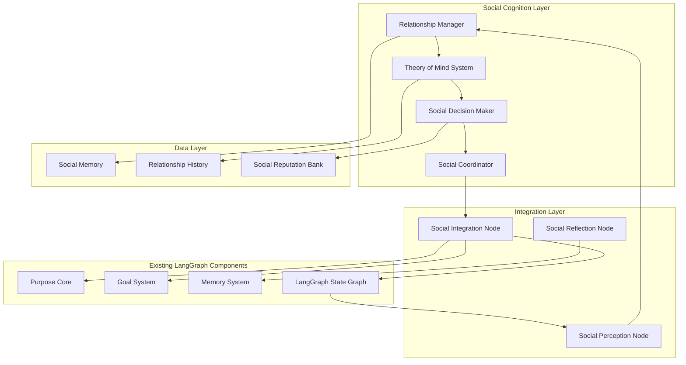
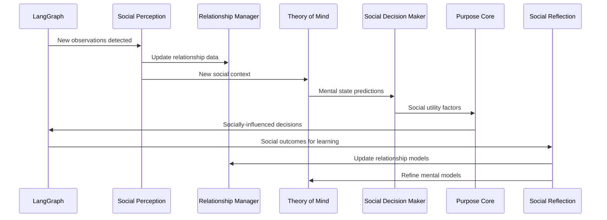
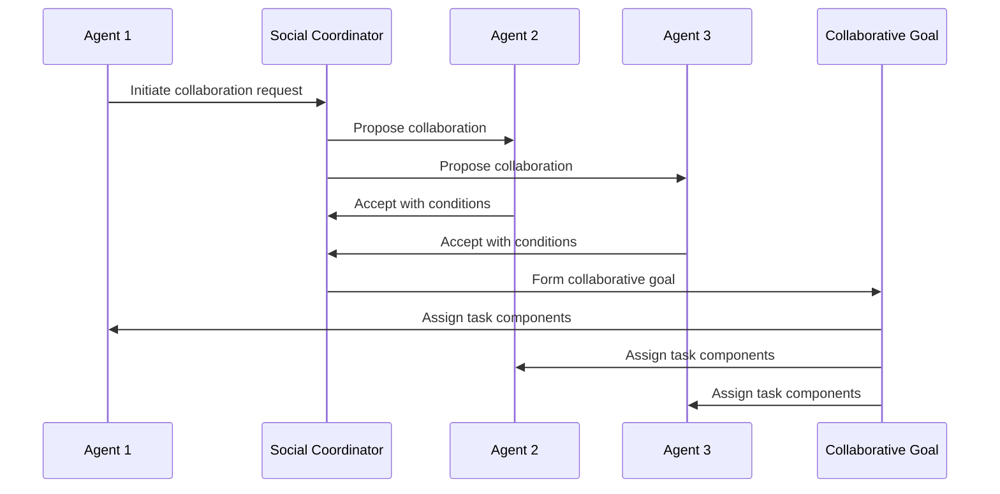

# Social Relationship System Architecture - Phase 3 Design

## Overview

This document presents the comprehensive architectural design for the Social Relationship System as part of Phase 3 of the Mindcraft LangGraph rewrite. The system focuses on agent-to-agent relationships with complete social cognition including theory of mind and social decision-making capabilities.

## Design Goals

1. **Agent-to-Agent Relationship Management**: Track trust, friendship, reputation, and social bonds between agents
2. **Theory of Mind Implementation**: Model other agents' intentions, knowledge, beliefs, and mental states
3. **Social Decision-Making Integration**: Influence purpose core and goal systems based on social context
4. **Multi-Agent Coordination**: Enable collaborative planning and conflict resolution
5. **Performance Optimization**: Support 50+ concurrent agents with linear scaling
6. **Legacy Compatibility**: Seamless integration with existing agent profiles and systems

## System Architecture

### High-Level Architecture



### Component Relationships

1. **Relationship Manager** ↔ **Theory of Mind**: Bi-directional data exchange for relationship-informed mental modeling
2. **Theory of Mind** → **Social Decision Maker**: Provides mental state predictions for decision-making
3. **Social Decision Maker** → **Social Coordinator**: Generates socially-aware action plans
4. **Social Coordinator** → **Social Integration Node**: Interfaces with LangGraph processing
5. **Social Integration Node** → **Purpose Core/Goal System**: Influences cognitive decision-making
6. **Social Perception Node** → **Relationship Manager**: Updates relationships based on observations
7. **Social Reflection Node** → **Memory System**: Stores social experiences for learning

## Core Components Design

### 1. Relationship Manager

**Purpose**: Track and manage agent-to-agent relationships with dynamic trust, friendship, and reputation systems.

**Key Features**:
- Multi-dimensional relationship tracking (trust, friendship, respect, rivalry)
- Dynamic relationship evolution based on interactions
- Reputation aggregation across agent network
- Relationship history and trend analysis
- Social network topology management

**Architecture Pattern**: Follows established cognitive component pattern with orchestrator class, configuration interface, and state management.

### 2. Theory of Mind System

**Purpose**: Model other agents' mental states including intentions, knowledge, beliefs, and emotional states.

**Key Features**:
- Intention recognition and prediction
- Knowledge state modeling (what others know)
- Belief system simulation
- Emotional state inference
- Perspective-taking capabilities
- Strategic deception detection

**Architecture Pattern**: Advanced cognitive modeling with probabilistic reasoning and learning from observation.

### 3. Social Decision Maker

**Purpose**: Integrate social context into decision-making processes, influencing goal selection and action planning.

**Key Features**:
- Social utility calculation for actions
- Group dynamics consideration
- Social conformity and influence modeling
- Conflict resolution strategies
- Collaborative opportunity identification
- Social risk assessment

**Architecture Pattern**: Decision-making interface that extends the existing Purpose Core decision patterns.

### 4. Social Coordinator

**Purpose**: Manage multi-agent coordination, communication protocols, and collaborative planning.

**Key Features**:
- Agent communication protocols
- Collaborative goal formation
- Task delegation and coordination
- Group decision facilitation
- Conflict mediation
- Social synchronization

**Architecture Pattern**: Coordination layer that interfaces with both cognitive and reactive systems.

## Integration Strategy

### LangGraph State Integration

The social system extends the existing `AgentState` interface:

```typescript
interface SocialState {
  relationships: RelationshipNetwork;
  theoryOfMind: TheoryOfMindState;
  socialContext: SocialContext;
  socialMemory: SocialMemoryState;
  socialProcessing: SocialProcessingState;
}

interface AgentState {
  // Existing components
  context: WorldContext;
  reactive: ReactiveState;
  cognitive: CognitiveState;
  executive: ExecutiveState;
  
  // New social component
  social: SocialState;
  
  // System metadata
  metadata: AgentMetadata;
}
```

### State Node Integration

New state nodes integrated into the LangGraph processing pipeline:

1. **Social Perception Node**: Processes social observations and updates relationships
2. **Social Analysis Node**: Analyzes social context and implications
3. **Theory of Mind Node**: Models mental states of other agents
4. **Social Decision Node**: Integrates social factors into decision-making
5. **Social Coordination Node**: Manages multi-agent interactions
6. **Social Reflection Node**: Learns from social experiences

### Memory System Integration

Social memory extends the existing memory architecture:

```typescript
interface SocialMemory {
  episodic: SocialEpisodicMemory;    // Social interactions and events
  semantic: SocialSemanticMemory;    // Social concepts and relationships
  procedural: SocialProceduralMemory; // Social skills and protocols
  working: SocialWorkingMemory;      // Active social context
}
```

## Data Flow Patterns

### Social Processing Cycle



### Multi-Agent Coordination Flow



## Performance Optimization

### Scaling Strategies

1. **Relationship Caching**: Cache frequently accessed relationship data with invalidation strategies
2. **Theory of Mind Bounding**: Limit mental modeling to socially relevant agents
3. **Social Context Filtering**: Process only salient social information
4. **Asynchronous Social Updates**: Non-blocking relationship updates
5. **Network Partitioning**: Divide agent network into manageable social clusters

### Memory Management

1. **Relationship Compression**: Compress historical relationship data
2. **Mental Model Pruning**: Remove outdated mental models
3. **Social Memory Consolidation**: Consolidate social experiences into semantic knowledge
4. **Lazy Loading**: Load social data on-demand

### Performance Targets

- **Social Processing**: <200ms for social context analysis
- **Relationship Updates**: <50ms for relationship state changes
- **Theory of Mind Modeling**: <300ms for mental state inference
- **Multi-Agent Coordination**: <500ms for collaborative planning
- **Memory Usage**: <500MB additional for social systems

## Legacy Compatibility

### Profile Integration

Existing agent profiles extended with social configuration:

```typescript
interface SocialProfile {
  socialPersonality: SocialPersonalityTraits;
  initialRelationships: RelationshipSeed[];
  socialPreferences: SocialPreferences;
  communicationStyle: CommunicationStyle;
  collaborationTendencies: CollaborationProfile;
}
```

### Migration Strategy

1. **Backward Compatibility**: All existing profiles work without social features
2. **Gradual Enhancement**: Social features activate when social data is present
3. **Default Social Behavior**: Reasonable defaults for agents without social configuration
4. **Legacy Bridge**: Convert existing social-related settings to new format

## Implementation Phases

### Phase 3.1: Core Relationship Management (Week 10)
- Relationship Manager implementation
- Basic trust and friendship systems
- Social memory integration
- LangGraph state extension

### Phase 3.2: Theory of Mind Implementation (Week 11)
- Mental state modeling
- Intention recognition
- Knowledge state tracking
- Social perception integration

### Phase 3.3: Social Decision-Making (Week 12)
- Social utility calculation
- Purpose core integration
- Goal system influence
- Social context processing

### Phase 3.4: Multi-Agent Coordination (Week 13)
- Social coordinator
- Communication protocols
- Collaborative planning
- Conflict resolution

## Testing Strategy

### Unit Testing
- Relationship calculation algorithms
- Theory of mind inference accuracy
- Social decision utility functions
- Memory consolidation processes

### Integration Testing
- LangGraph state node integration
- Memory system compatibility
- Purpose core influence
- Goal system modification

### Scenario Testing
- Multi-agent collaboration scenarios
- Conflict resolution situations
- Social learning experiments
- Performance stress testing

## Success Metrics

### Functional Metrics
- 90% accuracy in relationship prediction
- 85% accuracy in intention recognition
- 300% improvement in collaborative task completion
- Support for 50+ concurrent agents

### Performance Metrics
- <200ms social processing time
- <500MB additional memory usage
- Linear scaling with agent count
- 99.9% system availability

### Behavioral Metrics
- Emergent authentic social behavior
- Improved group coordination
- Reduced conflict resolution time
- Enhanced collaborative problem-solving

## Conclusion

The Social Relationship System architecture provides a comprehensive framework for sophisticated agent-to-agent interactions while maintaining compatibility with the existing LangGraph v2 cognitive architecture. The design follows established patterns, ensures performance at scale, and enables the emergence of authentic social behaviors that enhance the overall intelligence and believability of Minecraft NPCs.

This architecture serves as the foundation for Phase 3 implementation, with clear integration points, performance targets, and success metrics that align with the overall Mindcraft LangGraph rewrite objectives.