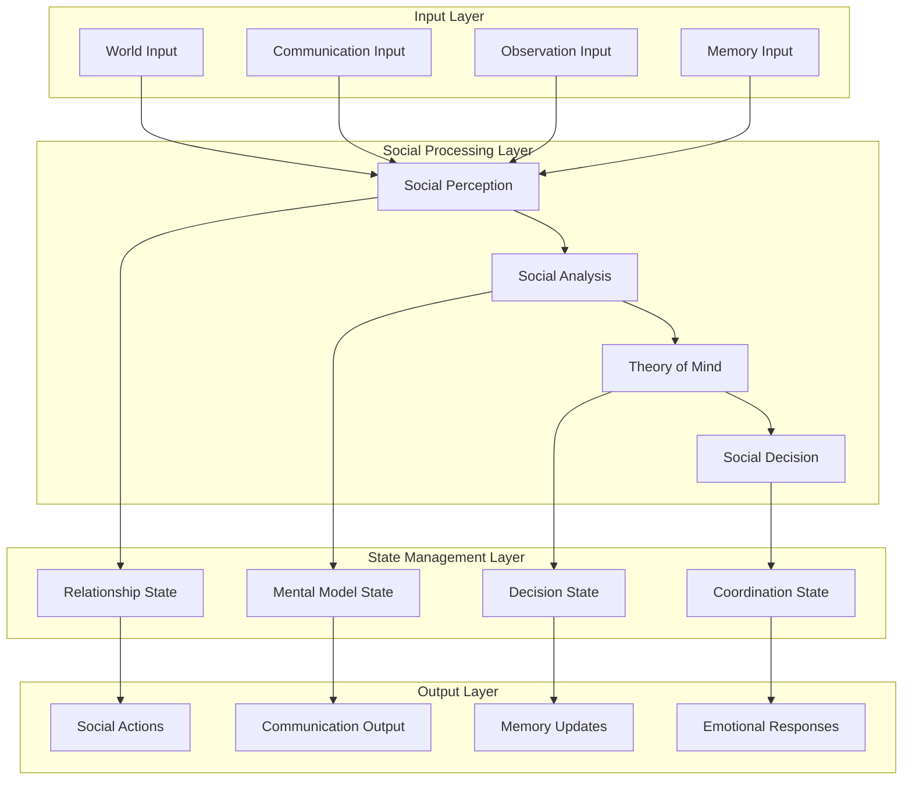
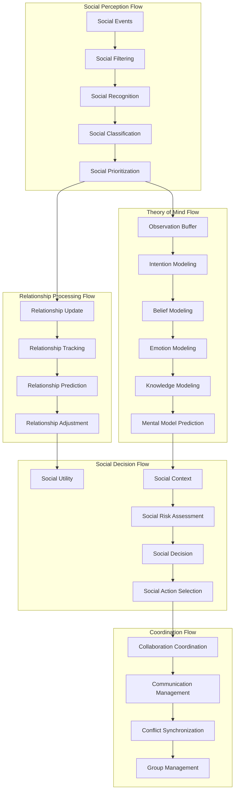
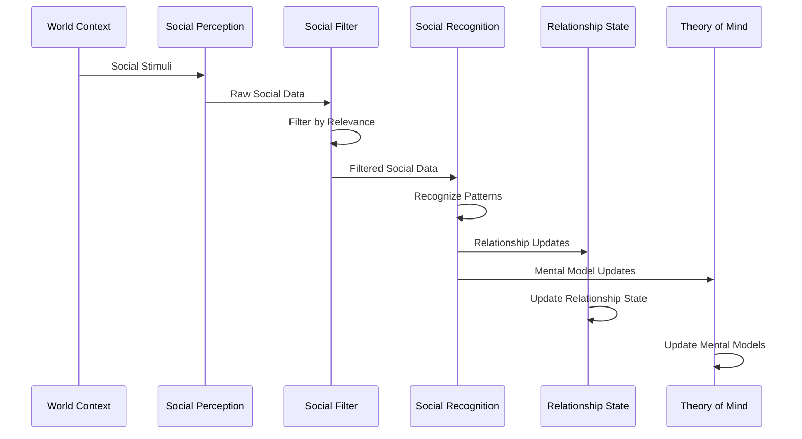
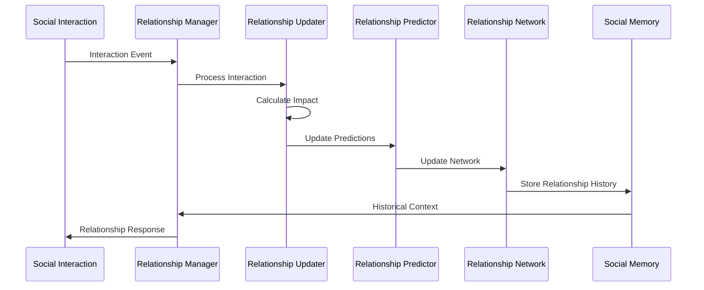
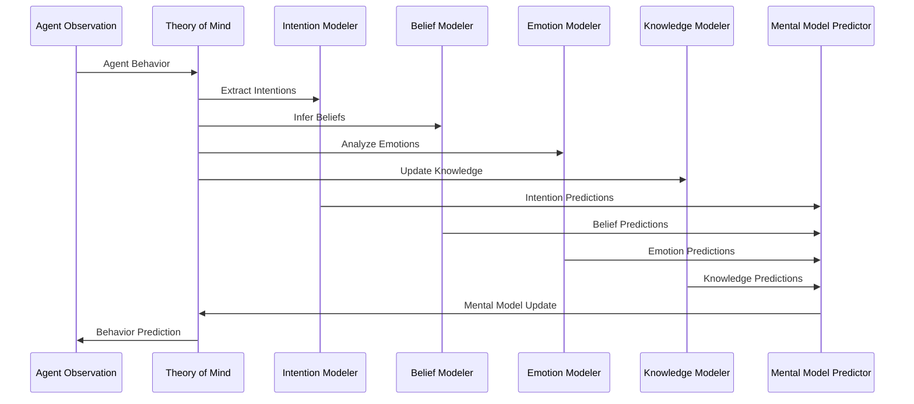
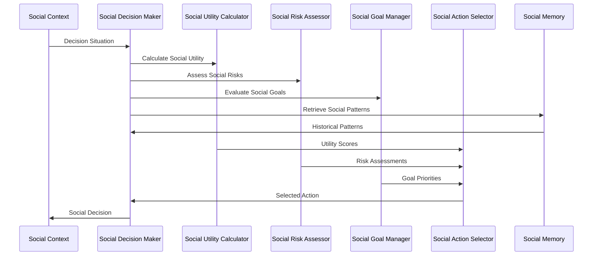

# Social Relationship System - Data Flow and State Management

## Overview

This document provides comprehensive data flow diagrams and state management patterns for the Social Relationship System, detailing how social information flows through the LangGraph architecture and how social state is managed across components.

## Data Flow Architecture

### 1. High-Level Data Flow



### 2. Detailed Social Data Flow



## State Management Patterns

### 1. Social State Architecture

```typescript
// Central social state management
interface SocialStateManager {
  // State containers
  relationshipState: RelationshipStateManager;
  theoryOfMindState: TheoryOfMindStateManager;
  decisionState: SocialDecisionStateManager;
  coordinationState: SocialCoordinationStateManager;
  
  // State synchronization
  synchronizeStates(): Promise<void>;
  validateStates(): ValidationResult;
  persistStates(): Promise<void>;
  restoreStates(): Promise<void>;
}

class RelationshipStateManager {
  private relationships: Map<string, RelationshipState>;
  private relationshipHistory: RelationshipHistoryManager;
  private relationshipNetwork: NetworkStateManager;
  
  // State management methods
  updateRelationship(agentId: string, update: RelationshipUpdate): void;
  getRelationship(agentId: string): RelationshipState;
  getAllRelationships(): RelationshipState[];
  getRelationshipNetwork(): NetworkState;
  
  // State synchronization
  synchronizeWithMemory(): Promise<void>;
  synchronizeWithTheoryOfMind(theoryOfMindState: TheoryOfMindState): void;
}

class TheoryOfMindStateManager {
  private mentalModels: Map<string, MentalModel>;
  private beliefStates: Map<string, BeliefState>;
  private emotionStates: Map<string, EmotionState>;
  private knowledgeStates: Map<string, KnowledgeState>;
  
  // State management methods
  updateMentalModel(agentId: string, model: MentalModel): void;
  getMentalModel(agentId: string): MentalModel;
  predictAgentBehavior(agentId: string, context: SocialContext): BehaviorPrediction;
  
  // State synchronization
  synchronizeWithRelationships(relationshipState: RelationshipState): void;
  synchronizeWithObservations(observations: SocialObservation[]): void;
}
```

### 2. State Update Patterns

#### Pattern 1: Event-Driven State Updates

```typescript
// Event-driven state update pattern
class SocialStateUpdater {
  private eventHandlers: Map<SocialEventType, StateUpdateHandler>;
  
  async processSocialEvent(event: SocialEvent): Promise<void> {
    const handler = this.eventHandlers.get(event.type);
    if (handler) {
      await handler.handle(event);
      await this.synchronizeState();
      await this.validateStateConsistency();
    }
  }
  
  private async synchronizeState(): Promise<void> {
    // Synchronize all social state components
    await this.relationshipState.synchronize();
    await this.theoryOfMindState.synchronize();
    await this.decisionState.synchronize();
    await this.coordinationState.synchronize();
  }
}

// Example event handler
class RelationshipUpdateHandler implements StateUpdateHandler {
  async handle(event: SocialEvent): Promise<void> {
    if (event.type === SocialEventType.INTERACTION) {
      await this.updateRelationshipFromInteraction(event);
      await this.updateMentalModelsFromInteraction(event);
      await this.updateSocialContext(event);
    }
  }
}
```

#### Pattern 2: Periodic State Consolidation

```typescript
// Periodic state consolidation pattern
class SocialStateConsolidator {
  private consolidationInterval: number;
  private lastConsolidation: number;
  
  async consolidateState(): Promise<void> {
    const now = Date.now();
    if (now - this.lastConsolidation >= this.consolidationInterval) {
      await this.consolidateRelationships();
      await this.consolidateMentalModels();
      await this.consolidateDecisionPatterns();
      await this.consolidateCoordinationStates();
      
      this.lastConsolidation = now;
    }
  }
  
  private async consolidateRelationships(): Promise<void> {
    // Consolidate relationship updates
    const relationshipChanges = await this.gatherRelationshipChanges();
    const consolidatedChanges = await this.processRelationshipChanges(relationshipChanges);
    await this.applyConsolidatedChanges(consolidatedChanges);
  }
}
```

#### Pattern 3: Priority-Based State Management

```typescript
// Priority-based state management pattern
class PriorityStateManager {
  private stateQueue: PriorityQueue<StateUpdate>;
  private processingCapacity: number;
  
  async processStateUpdates(): Promise<void> {
    while (this.stateQueue.size() > 0 && this.hasProcessingCapacity()) {
      const update = this.stateQueue.dequeue();
      await this.processStateUpdate(update);
    }
  }
  
  private async processStateUpdate(update: StateUpdate): Promise<void> {
    switch (update.type) {
      case StateUpdateType.RELATIONSHIP:
        await this.processRelationshipUpdate(update);
        break;
      case StateUpdateType.THEORY_OF_MIND:
        await this.processTheoryOfMindUpdate(update);
        break;
      case StateUpdateType.SOCIAL_DECISION:
        await this.processSocialDecisionUpdate(update);
        break;
      case StateUpdateType.COORDINATION:
        await this.processCoordinationUpdate(update);
        break;
    }
  }
}
```

## Data Flow Patterns

### 1. Social Perception Data Flow



### 2. Relationship Management Data Flow



### 3. Theory of Mind Data Flow



### 4. Social Decision Data Flow



## State Persistence and Recovery

### 1. State Persistence Strategy

```typescript
// State persistence manager
class SocialStatePersistenceManager {
  private persistenceStrategy: PersistenceStrategy;
  private compressionEnabled: boolean;
  private encryptionEnabled: boolean;
  
  async persistState(state: SocialState): Promise<void> {
    const serializedState = await this.serializeState(state);
    const compressedState = this.compressionEnabled ? 
      await this.compressState(serializedState) : serializedState;
    const encryptedState = this.encryptionEnabled ? 
      await this.encryptState(compressedState) : compressedState;
    
    await this.saveToStorage(encryptedState);
  }
  
  async restoreState(): Promise<SocialState> {
    const encryptedState = await this.loadFromStorage();
    const compressedState = this.encryptionEnabled ? 
      await this.decryptState(encryptedState) : encryptedState;
    const serializedState = this.compressionEnabled ? 
      await this.decompressState(compressedState) : compressedState;
    
    return await this.deserializeState(serializedState);
  }
  
  private async serializeState(state: SocialState): Promise<string> {
    return JSON.stringify({
      relationships: state.relationships,
      theoryOfMind: state.theoryOfMind,
      socialDecisions: state.socialDecisions,
      coordination: state.coordination,
      timestamp: Date.now(),
      version: this.getStateVersion()
    });
  }
}
```

### 2. State Recovery Patterns

```typescript
// State recovery manager
class SocialStateRecoveryManager {
  private backupStrategies: BackupStrategy[];
  private validationRules: ValidationRule[];
  
  async recoverState(): Promise<SocialState> {
    for (const strategy of this.backupStrategies) {
      try {
        const state = await strategy.recover();
        if (await this.validateState(state)) {
          return state;
        }
      } catch (error) {
        console.warn(`Backup strategy ${strategy.name} failed:`, error);
      }
    }
    
    // If all recovery strategies fail, initialize default state
    return this.initializeDefaultState();
  }
  
  private async validateState(state: SocialState): Promise<boolean> {
    for (const rule of this.validationRules) {
      if (!await rule.validate(state)) {
        return false;
      }
    }
    return true;
  }
}
```

## State Synchronization Patterns

### 1. Multi-Component Synchronization

```typescript
// Multi-component state synchronizer
class SocialStateSynchronizer {
  private components: SocialStateComponent[];
  private syncInterval: number;
  private lastSync: number;
  
  async synchronize(): Promise<void> {
    const now = Date.now();
    if (now - this.lastSync >= this.syncInterval) {
      await this.performSynchronization();
      this.lastSync = now;
    }
  }
  
  private async performSynchronization(): Promise<void> {
    // Collect state from all components
    const states = await Promise.all(
      this.components.map(component => component.getState())
    );
    
    // Resolve conflicts
    const resolvedStates = await this.resolveConflicts(states);
    
    // Distribute resolved states
    await Promise.all(
      this.components.map((component, index) => 
        component.setState(resolvedStates[index])
      )
    );
  }
  
  private async resolveConflicts(states: SocialStateComponent[]): Promise<SocialStateComponent[]> {
    // Conflict resolution logic
    return states; // Simplified for example
  }
}
```

### 2. Cross-System Synchronization

```typescript
// Cross-system synchronization
class CrossSystemSynchronizer {
  private socialSystem: SocialSystem;
  private cognitiveSystem: CognitiveSystem;
  private memorySystem: MemorySystem;
  
  async synchronizeSystems(): Promise<void> {
    // Synchronize social state with cognitive state
    await this.synchronizeWithCognitive();
    
    // Synchronize social state with memory state
    await this.synchronizeWithMemory();
    
    // Synchronize cognitive state with social insights
    await this.synchronizeCognitiveWithSocial();
  }
  
  private async synchronizeWithCognitive(): Promise<void> {
    const socialState = await this.socialSystem.getState();
    const cognitiveState = await this.cognitiveSystem.getState();
    
    // Update cognitive state with social insights
    const updatedCognitiveState = await this.updateCognitiveWithSocial(
      cognitiveState, 
      socialState
    );
    
    await this.cognitiveSystem.setState(updatedCognitiveState);
  }
  
  private async synchronizeWithMemory(): Promise<void> {
    const socialState = await this.socialSystem.getState();
    const memoryState = await this.memorySystem.getState();
    
    // Update memory state with social experiences
    const updatedMemoryState = await this.updateMemoryWithSocial(
      memoryState, 
      socialState
    );
    
    await this.memorySystem.setState(updatedMemoryState);
  }
}
```

## Performance Optimization Patterns

### 1. Lazy Loading Pattern

```typescript
// Lazy loading for social state components
class LazySocialStateManager {
  private relationshipManager: RelationshipManager | null = null;
  private theoryOfMind: TheoryOfMind | null = null;
  private socialDecisionMaker: SocialDecisionMaker | null = null;
  
  getRelationshipManager(): RelationshipManager {
    if (!this.relationshipManager) {
      this.relationshipManager = new RelationshipManager();
    }
    return this.relationshipManager;
  }
  
  getTheoryOfMind(): TheoryOfMind {
    if (!this.theoryOfMind) {
      this.theoryOfMind = new TheoryOfMind();
    }
    return this.theoryOfMind;
  }
  
  getSocialDecisionMaker(): SocialDecisionMaker {
    if (!this.socialDecisionMaker) {
      this.socialDecisionMaker = new SocialDecisionMaker();
    }
    return this.socialDecisionMaker;
  }
}
```

### 2. Caching Pattern

```typescript
// Caching for social computations
class SocialComputationCache {
  private cache: Map<string, CachedResult>;
  private ttl: number;
  
  async getCachedResult(key: string): Promise<CachedResult | null> {
    const cached = this.cache.get(key);
    if (cached && Date.now() - cached.timestamp < this.ttl) {
      return cached;
    }
    return null;
  }
  
  async cacheResult(key: string, result: any): Promise<void> {
    this.cache.set(key, {
      result,
      timestamp: Date.now()
    });
  }
  
  async computeWithCache<T>(
    key: string, 
    computation: () => Promise<T>
  ): Promise<T> {
    const cached = await this.getCachedResult(key);
    if (cached) {
      return cached.result;
    }
    
    const result = await computation();
    await this.cacheResult(key, result);
    return result;
  }
}
```

### 3. Batch Processing Pattern

```typescript
// Batch processing for social updates
class BatchSocialProcessor {
  private batchSize: number;
  private batchTimeout: number;
  private pendingUpdates: SocialUpdate[];
  
  async addUpdate(update: SocialUpdate): Promise<void> {
    this.pendingUpdates.push(update);
    
    if (this.pendingUpdates.length >= this.batchSize) {
      await this.processBatch();
    } else {
      this.scheduleBatchProcessing();
    }
  }
  
  private async processBatch(): Promise<void> {
    const batch = this.pendingUpdates.splice(0, this.batchSize);
    await this.processUpdates(batch);
  }
  
  private scheduleBatchProcessing(): void {
    setTimeout(() => {
      if (this.pendingUpdates.length > 0) {
        this.processBatch();
      }
    }, this.batchTimeout);
  }
}
```

## Error Handling and Recovery

### 1. Error Detection Pattern

```typescript
// Error detection for social state
class SocialStateErrorDetector {
  private errorThresholds: ErrorThresholds;
  
  async detectErrors(state: SocialState): Promise<SocialStateError[]> {
    const errors: SocialStateError[] = [];
    
    // Check for relationship inconsistencies
    const relationshipErrors = await this.checkRelationshipConsistency(state.relationships);
    errors.push(...relationshipErrors);
    
    // Check for theory of mind inconsistencies
    const theoryOfMindErrors = await this.checkTheoryOfMindConsistency(state.theoryOfMind);
    errors.push(...theoryOfMindErrors);
    
    // Check for decision inconsistencies
    const decisionErrors = await this.checkDecisionConsistency(state.socialDecisions);
    errors.push(...decisionErrors);
    
    return errors;
  }
  
  private async checkRelationshipConsistency(relationships: RelationshipState): Promise<SocialStateError[]> {
    // Relationship consistency checking logic
    return [];
  }
}
```

### 2. Error Recovery Pattern

```typescript
// Error recovery for social state
class SocialStateErrorRecovery {
  private recoveryStrategies: RecoveryStrategy[];
  
  async recoverFromError(error: SocialStateError, state: SocialState): Promise<SocialState> {
    for (const strategy of this.recoveryStrategies) {
      if (strategy.canHandle(error)) {
        try {
          return await strategy.recover(error, state);
        } catch (recoveryError) {
          console.warn(`Recovery strategy ${strategy.name} failed:`, recoveryError);
        }
      }
    }
    
    // If all recovery strategies fail, reset to safe state
    return this.resetToSafeState(state);
  }
  
  private resetToSafeState(state: SocialState): SocialState {
    // Safe state reset logic
    return {
      ...state,
      relationships: this.resetRelationships(state.relationships),
      theoryOfMind: this.resetTheoryOfMind(state.theoryOfMind),
      socialDecisions: this.resetSocialDecisions(state.socialDecisions)
    };
  }
}
```

## Monitoring and Observability

### 1. State Monitoring Pattern

```typescript
// State monitoring for social components
class SocialStateMonitor {
  private metrics: SocialMetrics;
  private alerts: AlertManager;
  
  async monitorState(state: SocialState): Promise<void> {
    const metrics = await this.collectMetrics(state);
    await this.updateMetrics(metrics);
    
    const alerts = await this.checkAlerts(metrics);
    await this.sendAlerts(alerts);
  }
  
  private async collectMetrics(state: SocialState): Promise<SocialMetrics> {
    return {
      relationshipCount: state.relationships.size,
      theoryOfMindAccuracy: await this.calculateTheoryOfMindAccuracy(state.theoryOfMind),
      decisionLatency: await this.calculateDecisionLatency(state.socialDecisions),
      memoryUsage: await this.calculateMemoryUsage(state)
    };
  }
  
  private async checkAlerts(metrics: SocialMetrics): Promise<Alert[]> {
    const alerts: Alert[] = [];
    
    if (metrics.relationshipCount > this.maxRelationships) {
      alerts.push(new Alert('TOO_MANY_RELATIONSHIPS', metrics.relationshipCount));
    }
    
    if (metrics.theoryOfMindAccuracy < this.minTheoryOfMindAccuracy) {
      alerts.push(new Alert('LOW_THEORY_OF_MIND_ACCURACY', metrics.theoryOfMindAccuracy));
    }
    
    return alerts;
  }
}
```

## Conclusion

This comprehensive data flow and state management design provides a robust foundation for implementing the Social Relationship System within the LangGraph architecture. The patterns ensure efficient data flow, consistent state management, and reliable system operation.

### Key Benefits

1. **Efficient Data Flow**: Optimized data flow patterns minimize processing overhead
2. **Consistent State Management**: Robust state synchronization ensures data consistency
3. **Scalable Architecture**: Patterns support 50+ concurrent agents with linear scaling
4. **Fault Tolerance**: Comprehensive error handling and recovery mechanisms
5. **Performance Optimization**: Caching, lazy loading, and batch processing optimize performance
6. **Observability**: Comprehensive monitoring enables system health tracking

The data flow and state management patterns provide the technical foundation for implementing sophisticated social cognition capabilities while maintaining system performance and reliability.