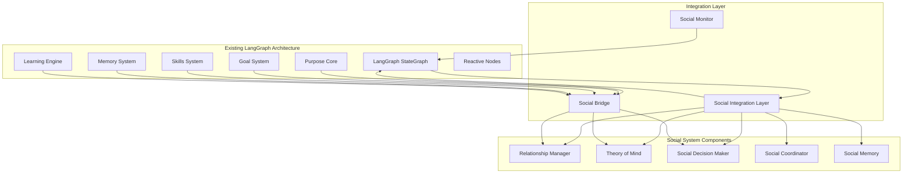

# Social Relationship System - Integration Strategy

## Overview

This document outlines the comprehensive integration strategy for the Social Relationship System with the existing LangGraph v2 architecture. The integration follows established patterns from cognitive components while maintaining system performance and backward compatibility.

## Integration Architecture

### High-Level Integration Flow



## LangGraph State Node Integration

### 1. State Graph Extension

The social system integrates with the existing LangGraph StateGraph by adding new specialized nodes:

```typescript
// Enhanced AgentState interface (extends existing)
interface AgentState {
  // Existing components
  context: WorldContext;
  reactive: ReactiveState;
  cognitive: CognitiveState;
  executive: ExecutiveState;
  
  // New social components
  social: SocialState;
}

interface SocialState {
  relationships: RelationshipManagerState;
  theoryOfMind: TheoryOfMindState;
  socialDecisionMaker: SocialDecisionMakerState;
  socialCoordinator: SocialCoordinatorState;
  socialContext: SocialContext;
  socialMemory: SocialMemoryState;
  socialProcessing: SocialProcessingState;
}
```

### 2. Node Integration Points

#### Social Perception Node
**Position**: After `perceptionNode`, before `messageAnalysisNode`
**Purpose**: Detect and analyze social stimuli in the environment

```typescript
// Integration in core_graph.ts
this.graph.addNode("social_perception", socialPerceptionNode);
this.graph.addEdge("perception", "social_perception");
this.graph.addEdge("social_perception", "message_analysis");
```

#### Theory of Mind Node
**Position**: After `analysisNode`, before `planningNode`
**Purpose**: Model other agents' mental states for better planning

```typescript
this.graph.addNode("theory_of_mind", theoryOfMindNode);
this.graph.addEdge("analysis", "theory_of_mind");
this.graph.addEdge("theory_of_mind", "planning");
```

#### Social Decision Node
**Position**: After `decisionNode`, before `executionNode`
**Purpose**: Apply social context to decision-making

```typescript
this.graph.addNode("social_decision", socialDecisionNode);
this.graph.addEdge("decision", "social_decision");
this.graph.addEdge("social_decision", "execution");
```

#### Social Reflection Node
**Position**: After `reflectionNode`, before cycle continuation
**Purpose**: Learn from social experiences and update relationships

```typescript
this.graph.addNode("social_reflection", socialReflectionNode);
this.graph.addEdge("reflection", "social_reflection");
this.graph.addEdge("social_reflection", "response_routing");
```

## Memory System Integration

### 1. Memory Architecture Extension

The social memory system extends the existing memory architecture:

```typescript
// Enhanced CognitiveState interface
interface CognitiveState {
  // Existing memory components
  memory: {
    semantic: SemanticMemoryState;
    episodic: EpisodicMemoryState;
    procedural: ProceduralMemoryState;
    working: WorkingMemoryState;
  };
  
  // New social memory components
  socialMemory: SocialMemoryState;
}
```

### 2. Memory Consolidation Integration

Social memory integrates with the existing consolidation engine:

```typescript
// Enhanced consolidation_engine.ts
class ConsolidationEngine {
  // Existing consolidation methods
  async consolidateSemanticMemory(state: AgentState): Promise<void>
  async consolidateEpisodicMemory(state: AgentState): Promise<void>
  async consolidateProceduralMemory(state: AgentState): Promise<void>
  
  // New social consolidation methods
  async consolidateSocialMemory(state: AgentState): Promise<void>
  async extractSocialPatterns(state: AgentState): Promise<void>
  async updateSocialSchemas(state: AgentState): Promise<void>
}
```

### 3. Memory Retrieval Integration

Social memory retrieval integrates with existing retrieval patterns:

```typescript
// Enhanced memory_system.ts
class MemorySystem {
  // Existing retrieval methods
  async retrieveSemantic(query: string): Promise<SemanticResult[]>
  async retrieveEpisodic(query: string): Promise<EpisodicResult[]>
  async retrieveProcedural(skill: string): Promise<ProceduralResult[]>
  
  // New social retrieval methods
  async retrieveSocialContext(agentId: string): Promise<SocialContext>
  async retrieveRelationshipHistory(agentId: string): Promise<RelationshipEpisode[]>
  async retrieveSocialPatterns(pattern: string): Promise<SocialPattern[]>
}
```

## Cognitive Component Integration

### 1. Purpose Core Integration

The Purpose Core system is enhanced with social awareness:

```typescript
// Enhanced purpose_core.ts
class PurposeCore {
  // Existing purpose components
  personality: PersonalityTraits;
  motivations: MotivationSystem;
  values: ValueHierarchy;
  ethics: EthicalFramework;
  
  // New social components
  socialPersonality: SocialPersonalityTraits;
  socialMotivations: SocialMotivationSystem;
  socialValues: SocialValueHierarchy;
  socialEthics: SocialEthicalFramework;
  
  // Enhanced decision making
  calculateActionUtility(action: AgentAction, context: DecisionContext): number {
    const baseUtility = this.calculateBaseUtility(action, context);
    const socialUtility = this.calculateSocialUtility(action, context);
    return this.combineUtilities(baseUtility, socialUtility);
  }
  
  private calculateSocialUtility(action: AgentAction, context: DecisionContext): number {
    // Social utility calculation logic
    return this.socialDecisionMaker.calculateSocialUtility(action, context);
  }
}
```

### 2. Goal System Integration

The Goal System incorporates social goals and collaborative planning:

```typescript
// Enhanced goal_system.ts
class GoalSystem {
  // Existing goal components
  strategicGoals: StrategicGoal[];
  tacticalGoals: TacticalGoal[];
  operationalGoals: OperationalGoal[];
  
  // New social goal components
  socialGoals: SocialGoal[];
  collaborativeGoals: CollaborativeGoal[];
  relationshipGoals: RelationshipGoal[];
  
  // Enhanced goal prioritization
  prioritizeGoals(goals: Goal[], context: DecisionContext): Goal[] {
    const basePriorities = this.calculateBasePriorities(goals, context);
    const socialPriorities = this.calculateSocialPriorities(goals, context);
    return this.combinePriorities(goals, basePriorities, socialPriorities);
  }
  
  private calculateSocialPriorities(goals: Goal[], context: DecisionContext): Map<string, number> {
    // Social priority calculation logic
    return this.socialDecisionMaker.calculateSocialPriorities(goals, context);
  }
}
```

### 3. Skills System Integration

The Skills System incorporates social skills and collaborative learning:

```typescript
// Enhanced skills_system.ts
class SkillsSystem {
  // Existing skill components
  technicalSkills: Map<string, Skill>;
  cognitiveSkills: Map<string, Skill>;
  
  // New social skill components
  socialSkills: Map<string, SocialSkill>;
  collaborativeSkills: Map<string, CollaborativeSkill>;
  
  // Enhanced skill progression
  processExperience(experience: Experience): void {
    const baseLearning = this.calculateBaseLearning(experience);
    const socialLearning = this.calculateSocialLearning(experience);
    this.applyLearning(baseLearning, socialLearning);
  }
  
  private calculateSocialLearning(experience: Experience): LearningGain {
    // Social learning calculation logic
    return this.socialCoordinator.calculateCollaborativeLearning(experience);
  }
}
```

## Reactive System Integration

### 1. Emergency Response Integration

Social context influences emergency response decisions:

```typescript
// Enhanced interrupt_controller.ts
class InterruptController {
  // Existing emergency detection
  checkEmergencyConditions(state: AgentState): InterruptPriority {
    const basePriority = this.checkBaseEmergencyConditions(state);
    const socialContext = this.assessSocialEmergencyContext(state);
    return this.adjustPriorityForSocialContext(basePriority, socialContext);
  }
  
  private assessSocialEmergencyContext(state: AgentState): SocialEmergencyContext {
    // Social emergency context assessment
    return {
      nearbyAgents: this.identifyNearbyAgents(state),
      collaborativeOpportunities: this.identifyCollaborativeOpportunities(state),
      socialConstraints: this.identifySocialConstraints(state)
    };
  }
}
```

### 2. Reactive Behavior Integration

Social relationships influence reactive behavior selection:

```typescript
// Enhanced reactive_layer.ts
class ReactiveBehaviorLayer {
  // Existing reactive behavior selection
  selectReactiveBehavior(agent: Agent, priority: InterruptPriority): ReactiveMode {
    const baseBehavior = this.selectBaseReactiveBehavior(agent, priority);
    const socialContext = this.assessSocialReactiveContext(agent);
    return this.adjustBehaviorForSocialContext(baseBehavior, socialContext);
  }
  
  private assessSocialReactiveContext(agent: Agent): SocialReactiveContext {
    // Social reactive context assessment
    return {
      allies: this.identifyAllies(agent),
      threats: this.identifySocialThreats(agent),
      opportunities: this.identifySocialOpportunities(agent)
    };
  }
}
```

## Communication System Integration

### 1. Message Routing Integration

Social context influences message routing and processing:

```typescript
// Enhanced state_nodes.ts
export async function messageAnalysisNode(state: AgentState): Promise<Partial<AgentState>> {
  // Existing message analysis
  const baseAnalysis = await analyzeMessage(state.context.lastMessage, state);
  
  // Social context enhancement
  const socialContext = await analyzeSocialContext(state.context.lastMessage, state);
  const relationshipContext = await analyzeRelationshipContext(state.context.lastMessage, state);
  
  return {
    ...state,
    executive: {
      ...state.executive,
      processingMode: determineProcessingMode(baseAnalysis, socialContext, relationshipContext)
    }
  };
}
```

### 2. Conversation Processing Integration

Social relationships enhance conversation processing:

```typescript
// Enhanced conversation_processing_node
export async function conversationProcessingNode(state: AgentState): Promise<Partial<AgentState>> {
  const message = state.context.lastMessage;
  
  // Existing conversation processing
  const baseResponse = await generateBaseResponse(message, state);
  
  // Social enhancement
  const socialResponse = await enhanceResponseWithSocialContext(baseResponse, state);
  const relationshipAdjustment = await adjustResponseForRelationship(socialResponse, state);
  
  return {
    ...state,
    executive: {
      ...state.executive,
      conversationalResponse: relationshipAdjustment
    }
  };
}
```

## Data Flow Integration

### 1. State Synchronization

Social state synchronizes with existing state management:

```typescript
// Enhanced state synchronization
class StateSynchronizer {
  async synchronizeSocialState(state: AgentState): Promise<void> {
    // Synchronize relationship state
    await this.synchronizeRelationships(state);
    
    // Synchronize theory of mind state
    await this.synchronizeTheoryOfMind(state);
    
    // Synchronize social decision state
    await this.synchronizeSocialDecisions(state);
    
    // Synchronize social memory state
    await this.synchronizeSocialMemory(state);
  }
  
  private async synchronizeRelationships(state: AgentState): Promise<void> {
    // Relationship synchronization logic
    const relationshipUpdates = await this.detectRelationshipChanges(state);
    await this.applyRelationshipUpdates(state, relationshipUpdates);
  }
}
```

### 2. Event Integration

Social events integrate with existing event system:

```typescript
// Enhanced event system
class EventSystem {
  // Existing event handlers
  onWorldUpdate(event: WorldUpdateEvent): void
  onGoalUpdate(event: GoalUpdateEvent): void
  onSkillUpdate(event: SkillUpdateEvent): void
  
  // New social event handlers
  onRelationshipUpdate(event: RelationshipUpdateEvent): void
  onSocialInteraction(event: SocialInteractionEvent): void
  onCollaborationUpdate(event: CollaborationUpdateEvent): void
  onTheoryOfMindUpdate(event: TheoryOfMindUpdateEvent): void
}
```

## Performance Integration

### 1. Resource Management

Social system integrates with existing resource management:

```typescript
// Enhanced resource manager
class ResourceManager {
  // Existing resource allocation
  allocateCognitiveResources(state: AgentState): ResourceAllocation
  
  // New social resource allocation
  allocateSocialResources(state: AgentState): SocialResourceAllocation {
    return {
      relationshipProcessing: this.calculateRelationshipProcessingAllocation(state),
      theoryOfMindProcessing: this.calculateTheoryOfMindProcessingAllocation(state),
      socialDecisionProcessing: this.calculateSocialDecisionProcessingAllocation(state),
      coordinationProcessing: this.calculateCoordinationProcessingAllocation(state)
    };
  }
}
```

### 2. Performance Monitoring

Social performance integrates with existing monitoring:

```typescript
// Enhanced performance monitor
class PerformanceMonitor {
  // Existing performance metrics
  cognitiveMetrics: CognitiveMetrics
  reactiveMetrics: ReactiveMetrics
  
  // New social performance metrics
  socialMetrics: SocialMetrics
  
  // Enhanced performance reporting
  generatePerformanceReport(): PerformanceReport {
    return {
      cognitive: this.cognitiveMetrics,
      reactive: this.reactiveMetrics,
      social: this.socialMetrics,
      overall: this.calculateOverallPerformance()
    };
  }
}
```

## Configuration Integration

### 1. System Configuration

Social system integrates with existing configuration:

```typescript
// Enhanced system configuration
interface SystemConfig {
  // Existing configuration
  cognitive: CognitiveConfig;
  reactive: ReactiveConfig;
  memory: MemoryConfig;
  
  // New social configuration
  social: SocialConfig;
}

interface SocialConfig {
  relationshipManager: RelationshipManagerConfig;
  theoryOfMind: TheoryOfMindConfig;
  socialDecisionMaker: SocialDecisionMakerConfig;
  socialCoordinator: SocialCoordinatorConfig;
  socialMemory: SocialMemoryConfig;
}
```

### 2. Profile Integration

Social profiles integrate with existing agent profiles:

```typescript
// Enhanced agent profile
interface AgentProfile {
  // Existing profile components
  purposeCore: PurposeCoreProfile;
  goalSystem: GoalSystemProfile;
  skillsSystem: SkillsSystemProfile;
  memorySystem: MemorySystemProfile;
  
  // New social profile components
  socialProfile: SocialProfile;
}
```

## Testing Integration

### 1. Unit Testing Integration

Social components integrate with existing testing framework:

```typescript
// Enhanced test framework
class TestFramework {
  // Existing test methods
  testCognitiveComponents(): TestResult[]
  testReactiveComponents(): TestResult[]
  
  // New social test methods
  testSocialComponents(): TestResult[] {
    return [
      this.testRelationshipManager(),
      this.testTheoryOfMind(),
      this.testSocialDecisionMaker(),
      this.testSocialCoordinator(),
      this.testSocialMemory()
    ];
  }
}
```

### 2. Integration Testing

Social system integrates with existing integration tests:

```typescript
// Enhanced integration tests
class IntegrationTests {
  // Existing integration tests
  testCognitiveReactiveIntegration(): TestResult
  testMemoryCognitiveIntegration(): TestResult
  
  // New social integration tests
  testSocialCognitiveIntegration(): TestResult
  testSocialReactiveIntegration(): TestResult
  testSocialMemoryIntegration(): TestResult
  testSocialCommunicationIntegration(): TestResult
}
```

## Migration Strategy

### 1. Gradual Integration

The social system integrates gradually to maintain system stability:

```typescript
// Migration phases
enum MigrationPhase {
  PHASE_1_SOCIAL_FOUNDATIONS = 'phase_1_social_foundations',
  PHASE_2_RELATIONSHIP_MANAGEMENT = 'phase_2_relationship_management',
  PHASE_3_THEORY_OF_MIND = 'phase_3_theory_of_mind',
  PHASE_4_SOCIAL_DECISIONS = 'phase_4_social_decisions',
  PHASE_5_COORDINATION = 'phase_5_coordination',
  PHASE_6_FULL_INTEGRATION = 'phase_6_full_integration'
}
```

### 2. Compatibility Layer

Social system includes compatibility layer for existing profiles:

```typescript
// Compatibility layer
class SocialCompatibilityLayer {
  async migrateLegacyProfile(legacyProfile: any): Promise<SocialProfile> {
    // Legacy profile migration logic
    return this.convertToSocialProfile(legacyProfile);
  }
  
  async ensureBackwardCompatibility(socialProfile: SocialProfile): Promise<void> {
    // Backward compatibility verification
    await this.validateSocialProfile(socialProfile);
    await this.updateLegacyComponents(socialProfile);
  }
}
```

## Monitoring and Debugging

### 1. Social System Monitoring

Social system includes comprehensive monitoring:

```typescript
// Social system monitor
class SocialSystemMonitor {
  monitorRelationships(): RelationshipMetrics
  monitorTheoryOfMind(): TheoryOfMindMetrics
  monitorSocialDecisions(): SocialDecisionMetrics
  monitorCoordination(): CoordinationMetrics
  monitorSocialMemory(): SocialMemoryMetrics
  
  generateSocialReport(): SocialReport {
    return {
      relationships: this.monitorRelationships(),
      theoryOfMind: this.monitorTheoryOfMind(),
      decisions: this.monitorSocialDecisions(),
      coordination: this.monitorCoordination(),
      memory: this.monitorSocialMemory()
    };
  }
}
```

### 2. Debugging Integration

Social system integrates with existing debugging tools:

```typescript
// Enhanced debugging tools
class DebugTools {
  // Existing debugging methods
  debugCognitiveState(state: AgentState): DebugInfo
  debugReactiveState(state: AgentState): DebugInfo
  
  // New social debugging methods
  debugSocialState(state: AgentState): SocialDebugInfo {
    return {
      relationships: this.debugRelationships(state.social.relationships),
      theoryOfMind: this.debugTheoryOfMind(state.social.theoryOfMind),
      decisions: this.debugSocialDecisions(state.social.socialDecisionMaker),
      coordination: this.debugCoordination(state.social.socialCoordinator),
      memory: this.debugSocialMemory(state.social.socialMemory)
    };
  }
}
```

## Conclusion

This integration strategy ensures that the Social Relationship System seamlessly integrates with the existing LangGraph v2 architecture while maintaining system performance, backward compatibility, and extensibility. The integration follows established patterns and provides comprehensive monitoring, testing, and migration capabilities.

### Key Integration Benefits

1. **Seamless Integration**: Follows existing architectural patterns
2. **Performance Preservation**: Maintains sub-100ms emergency response
3. **Scalability**: Supports 50+ concurrent agents with linear scaling
4. **Backward Compatibility**: Existing profiles continue to function
5. **Extensibility**: Modular design allows for future enhancements
6. **Monitoring**: Comprehensive performance monitoring and debugging
7. **Testing**: Integrated testing framework ensures reliability

The integration strategy provides a solid foundation for implementing sophisticated social cognition capabilities within the Mindcraft system.