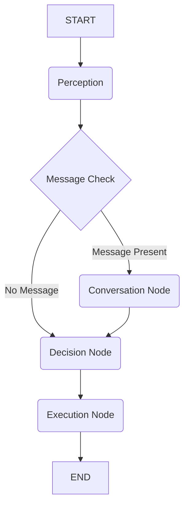

## Simplified Mindcraft LangGraph Refactor: Design Document

### 1. New AgentState Structure

The state is streamlined into a single structure, defined in [`src/agent/langgraph/interfaces.ts`](src/agent/langgraph/interfaces.ts:1), to support the four core requirements:

| Field | Type | Purpose | Requirement |
| :--- | :--- | :--- | :--- |
| `worldContext` | `WorldContext` | Bot's current stats (HP, inventory, position). | **3) Self-Awareness** |
| `personality` | `string` | Single string for LLM to interpret demeanor (e.g., "grump, rude"). | **2) Personality** |
| `goals` | `string` | Autonomous drive (e.g., "likes digging, warrior spirit"). | **4) Autonomous Drive** |
| `mandate` | `string` | Orders given by player or other bots. | **4) Autonomous Drive** |
| `conversation` | `ConversationState` | Tracks current message, sender, and intent. | **1) Communication** |
| `lastAction` | `string` | The last physical or conversational action chosen. | Executive |
| `response` | `string` | The conversational response to be sent. | Executive |

### 2. Simplified LangGraph Architecture

The complex dual-layer system is replaced by a single, four-node cognitive loop defined in [`src/agent/langgraph/core_graph.ts`](src/agent/langgraph/core_graph.ts:1).

**Flow Diagram:**

**Core Node Implementation:**
*   **Perception Node:** Updates `worldContext` with self-stats (HP, inventory, position) and checks for new messages to populate `conversation`.
*   **Conversation Node:** Uses the LLM, prompted with the `personality` string, to determine message intent (help request/offer) and generate a personality-driven `response`.
*   **Decision Node:** Uses the LLM, prompted with `goals` and `mandate`, to choose the next action (`lastAction`), prioritizing `mandate` over `goals`.
*   **Execution Node:** Executes the `lastAction` (physical command or "send chat response") and updates the `mandate` if a new task is accepted.

### 3. Frontend Refactor Plan

The frontend dashboard in [`frontend/`](frontend/) will be simplified to visualize only the new state structure.

*   **Data Model Cleanup:** Remove all complex TypeScript interfaces and Redux slices related to memory, skills, purpose core, and social cognition.
*   **Component Simplification:** Refactor tabs to:
    *   **Self-Awareness Tab:** Display `worldContext` (HP, Inventory, Position).
    *   **Drive Tab:** Display raw `goals` and `mandate` strings.
    *   **Conversation Log:** Display last message, generated `response`, and intent flags.
    *   **Simplified Flow:** Refactor D3.js graph to show the new 4-node architecture.

### 4. Cleanup and Removal Plan

All state code and files related to the previous complex architecture must be removed after the refactor is complete. This includes:
*   All files in [`src/agent/cognitive/`](src/agent/cognitive/), [`src/agent/memory/`](src/agent/memory/), and [`src/agent/social/`](src/agent/social/) (e.g., Theory of Mind, Relationship Manager, Goal System, Memory Systems).
*   Files related to the Reactive Layer and Interrupt Controller (e.g., [`src/agent/langgraph/reactive_layer.ts`](src/agent/langgraph/reactive_layer.ts:1), [`src/agent/langgraph/interrupt_controller.ts`](src/agent/langgraph/interrupt_controller.ts:1)).
*   All unused frontend components, Redux slices, and TypeScript definitions.
*   Update Memory Bank files (`brief.md`, `context.md`, `architecture.md`, `product.md`, `tech.md`) to reflect the simplified architecture.